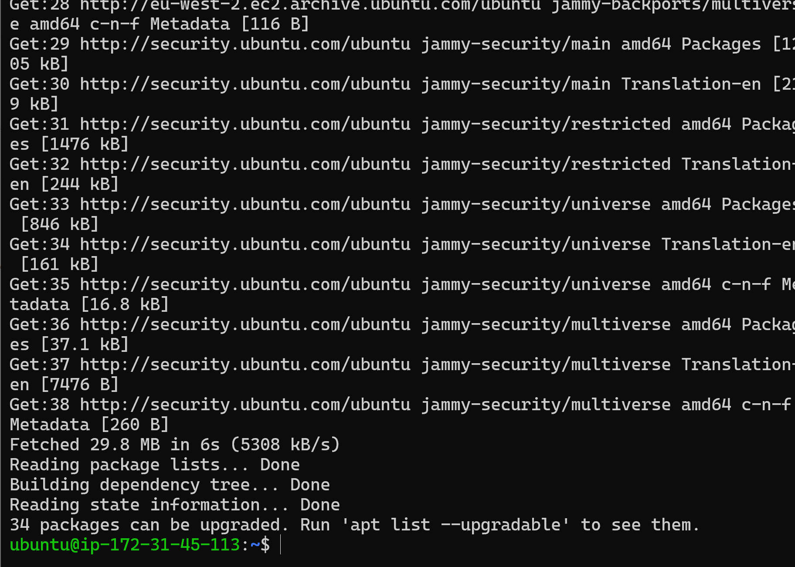
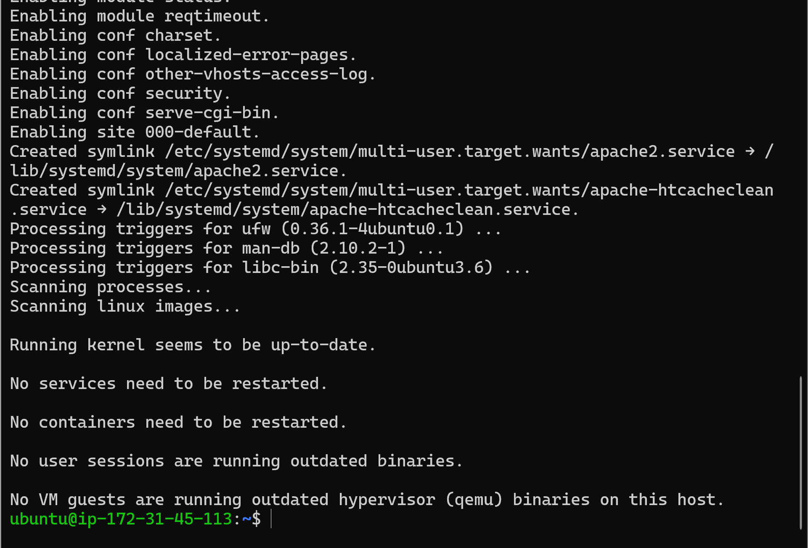
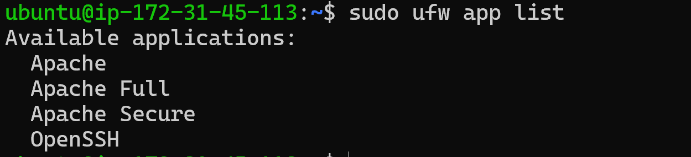
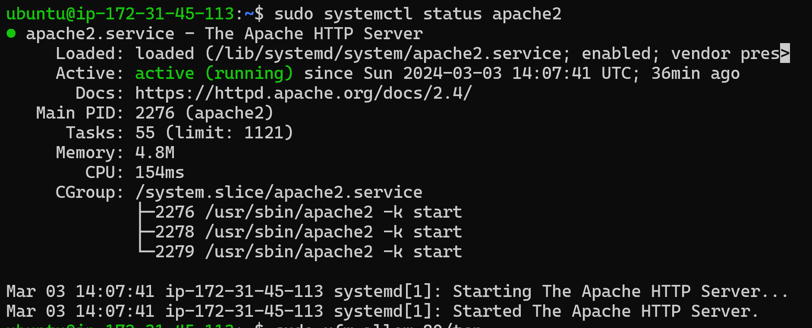
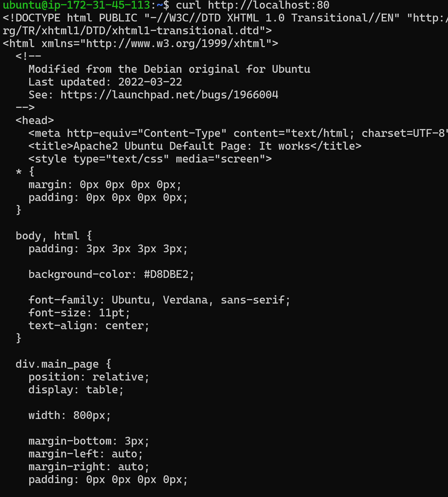
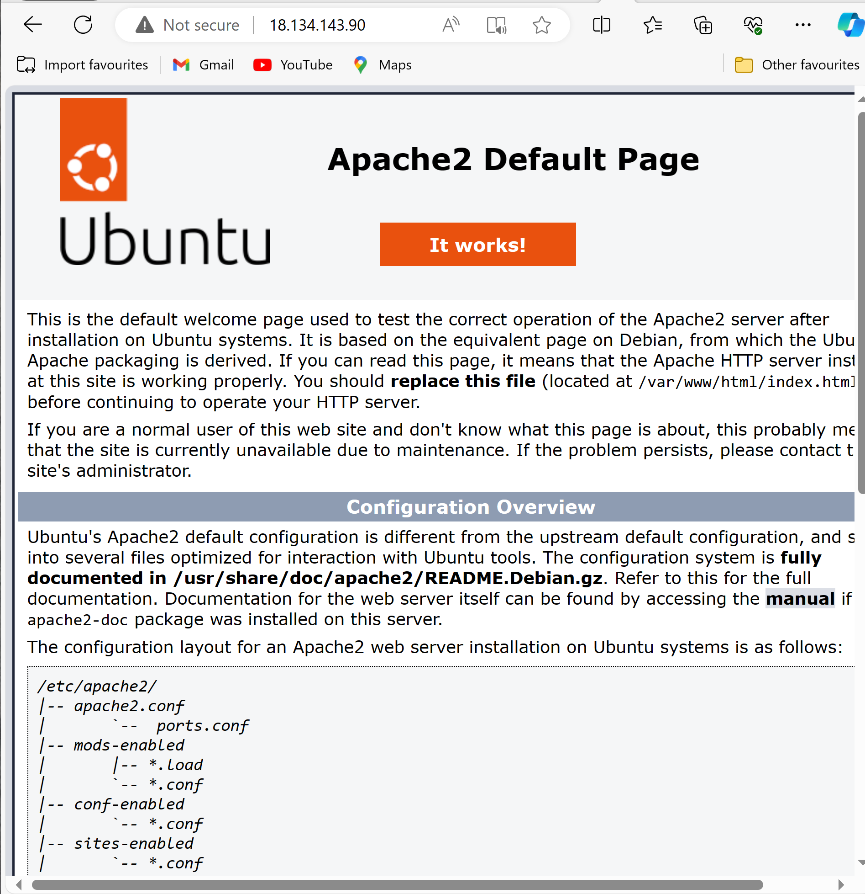
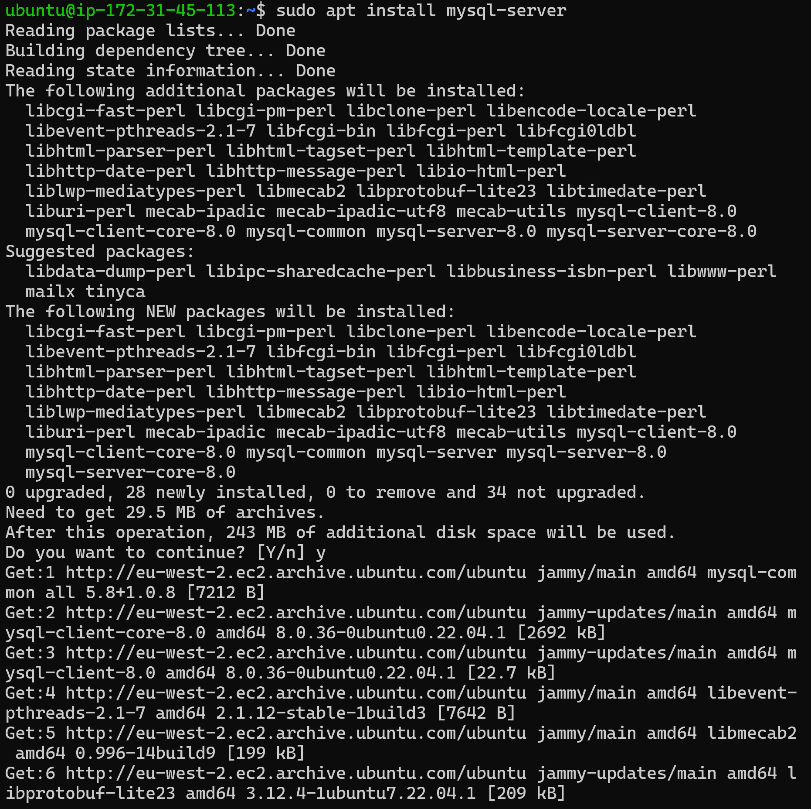
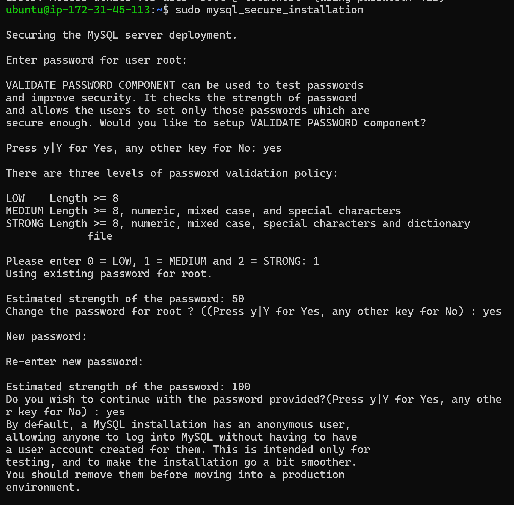
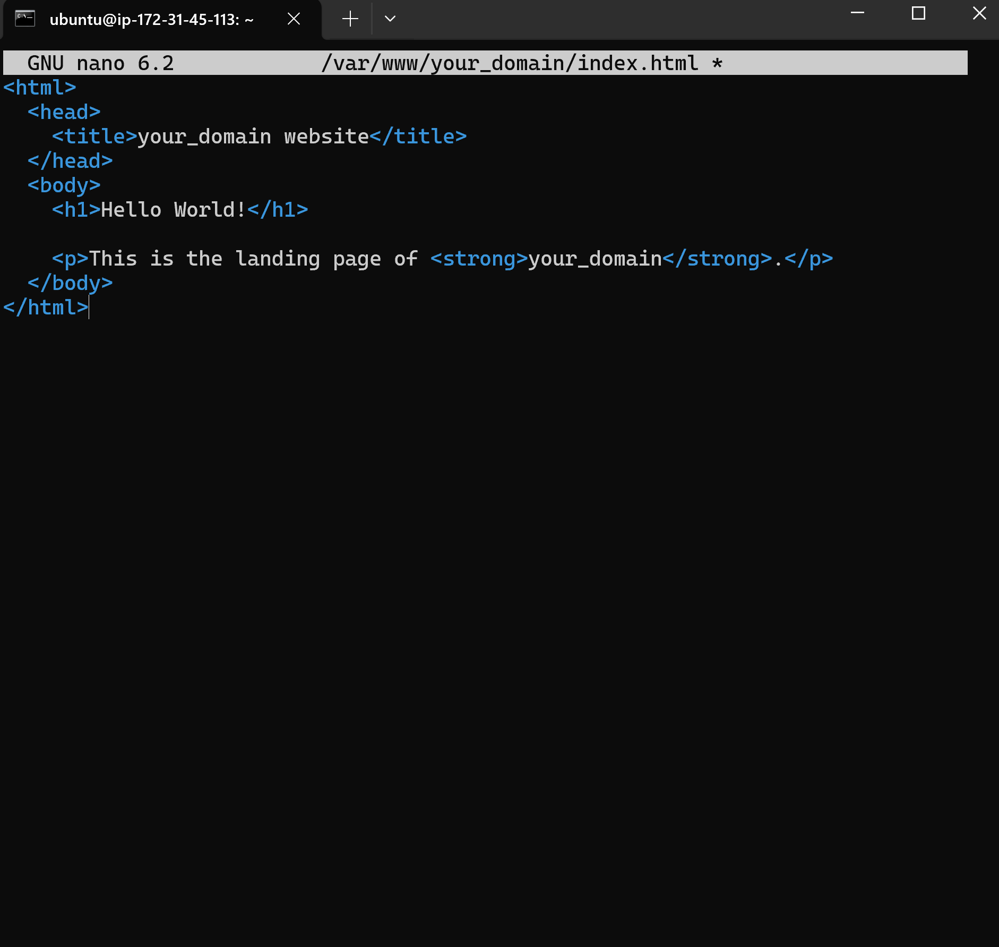

# ASSIGNMENT1
## DEFINITION OF DEVOPS
Devops is an abbreviation of developments and Operations is a software developmet ideologies and approach that aim to improve the teamwork between develoment and IT Operations, it focuses on cooperation, communication automation 

### IMPORTANCE OF DEVOPS

1. It creates better teamwork and faster time to market
Software development, testing, and deployment can be automated through continuous integration and continuous delivery (CI/CD) pipelines, leading to shorter release cycles. DevOps promotes improved communication and collaboration among development, operations, and other stakeholders, creating a more harmonious and productive workplace.

2. It brings about eficiency and good quality of work
The total productivity of development and operational workflows is increased by the automation of repetitive activities, which minimizes manual mistakes and speeds procedures, continuous testing and automated deployment help identify and address issues earlier in the development process, improving the overall quality of the software.

3. It helps with continous monitoring
Continuous monitoring of applications and infrastructure is a key principle in DevOps. This approach enables proactive problem resolution by providing real-time insights into performance.

4 It Enhances customer satisfaction, mitigates risk, adjusts to market demands and conditions, and transforms culture
Improved customer satisfaction is a result of faster software releases, better quality software, and quicker problem-solving. Features and repairs are delivered more quickly. Teams are able to react swiftly to changing business demands thanks to DevOps principles, which provide quicker adaptation to shifting requirements and market conditions. Continuous testing and automated rollback mechanisms reduce the risk of releasing defective code into production by identifying and addressing potential problems early in the development process. Additionally, DevOps frequently entails a cultural shift that fosters a more positive and productive workplace culture by encouraging collaboration, shared responsibility, and a focus on delivering value to customers.

### HISTORY OF DEVOPS

Challenges with conventional software development and IT operations procedures gave rise to the idea of DevOps. In 2001, the Agile Manifesto was created, which set the groundwork for customer-focused and cooperative software development. Infrastructure as Code, or IaC, rose to popularity in the middle of the 2000s when infrastructure settings were automated by technologies like Puppet and Chef.
Web operations teams started pursuing quicker and more dependable deployment procedures for web-based applications in the late 2000s, which gave rise to the DevOps movement. Professionals from development and operations came together for the inaugural DevOpsDays conference in 2009, which took place in Ghent, Belgium, to talk about cooperation, automation, and cultural shifts.
Three Ways are a collection of concepts that represent the essential ideals of DevOps, and they were first established in the 2013 novel "The Phoenix Project," written by Gene Kim, Kevin Behr, and George Spafford. This project served as an example of how DevOps techniques may change IT companies.
The word "DevOps" was originally used in 2009 by Patrick Debois, who also organized the inaugural DevOpsDays. In the "Declaration of DevOps," which stressed automation, cooperation, and communication, Debois articulated the guiding principles of the movement.
Practices known as Continuous Integration and Continuous Delivery (CI/CD), which emphasize automating the development, testing, and deployment of software, became popular. Jenkins, Travis CI, GitLab CI, and other tools have become essential components of the CI/CD process, the DevOps Institute was established in 2015 with the goal of offering professionals the education and certification programs necessary to get the competencies required for successful DevOps deployment.
Launched in 2014, the DevOps Enterprise Summit (DOES) gives enterprises a forum to discuss problems, best practices, and success stories related to DevOps.
Version control, continuous integration, infrastructure as code, containerization (like Docker), and orchestration (like Kubernetes) are just a few of the tools that have helped DevOps continue to grow.

### DEVOPS CULTURE
DevOps culture emphasizes collaboration, communication, automation, and shared responsibility between development and operations teams to achieve faster, more reliable software delivery.

## SDLC (Software Development LifeCycle)

### CONCEPTS OF SDLC
The Software Development Life Cycle (SDLC) is a structured process that guides the planning, creation, testing, deployment, and maintenance of software applications or systems. It begins with project planning, defining scope, objectives, and resource requirements. Requirements are gathered from stakeholders, and a detailed design is created. The implementation phase involves coding, transforming the design into executable code. Testing includes various phases like unit testing, integration testing, and user acceptance testing. Once tested, the software is deployed to production or end-users. The maintenance phase addresses issues and updates throughout the software's operational life. SDLC can take various models, such as Waterfall, Agile, Spiral, or Iterative, chosen based on project requirements and timelines.

### WHY IT IS IMPORTANT TO DEVOPS ENGINEER

Because it offers a formal framework for combining development and operations, the SDLC is essential for DevOps engineers. This allows for continuous integration, delivery, and deployment. It guarantees a methodical approach to software development, promoting efficiency, automation, and teamwork across the course of the project.

### WHERE DEVOPS FITS IN SDLC
DevOps is a methodology that connects development (Dev) and operations (Ops) across the Software Development Life Cycle (SDLC). It covers the complete software development life cycle, from planning and coding to testing, deployment, and monitoring. DevOps approaches emphasize cooperation, automation, and continuous improvement throughout various phases, resulting in a simplified and effective software delivery process.

### CAN DEVOPS IMPROVE THE SDLC PROCESS
Yes it can. DevOps enhances the Software Development Life Cycle (SDLC) by focusing on collaboration, automation, and continuous improvement. DevOps speeds up development and deployment by using processes like as continuous integration, deployment, and monitoring. It also improves software quality and efficiency. It encourages quicker adaptability to changing needs, adheres to Agile principles, and creates feedback loops for rapid issue discovery and resolution. Furthermore, DevOps helps to mitigate risk by allowing early identification of possible issues and encouraging a cultural shift toward shared accountability and customer-centric value delivery. To summarize, DevOps improves the SDLC by making it more streamlined, adaptable, and efficient.

### IMAGES OF SDLC
`SDLC IMAGE` to show the processes involved in SDLC 

# Project 1
## Installing apache and updating the firewall

`sudo apt update` to update all the list of packages 

`sudo apt instal apache2` to install the apache package 

`sudo ufw app list` to list all currently available UFW application profiles 

`sudo ufw allow in "Apache"` to allow traffic on port 80 to allow http traffics and `sudo ufw status` to verify the changes i made 

`sudo systemctl status apache2 ` to confrim if the apache is running as a service in our operating system 

`local host and public adress` To access the server locally and also test how our Apache HTTP server can respond to requests from the Internet 

On web 

## Installing mysql

`sudo apt install mysql-serve` to acquire and install mysql server  

`sudo mysql` to login into MYSQL console 

`ALTER USER 'root'@'localhost' IDENTIFIED WITH mysql_native_password BY 'PassWord.1';` setting default password 

`sudo mysql_secure_installation` Changing the default password 

## Installing PHP

`sudo apt install php libapache2-mod-php php-mysql` Installing PHP 

`apt search php- | less` Installing PHP Extension 

## Creating a Virtual Host for my website

`sudo mkdir /var/www/projectlamp` Creating a virtual host and also creating the directory for project lamb, `sudo a2ensite projectlamp` to enable the new virtual host after creating a new configuration 

`nano /var/www/your_domain/index.html` To create an index.html file in the location to test that the virtual host works as expected 

`http://server_domain_or_IP` To access my IP adress on web 

`sudo nano /etc/apache2/mods-enabled/dir.conf` To allow index.php take precedence over index.html on the landing page 

## Testing PHP Processing on your Web Server

`nano /var/www/your_domain/info.php` To create a PHP test script to confirm that Apache is able to handle and process requests for PHP files 

`http://server_domain_or_IP` Web test for PHP 

## Testing Testing databse connection from php

`sudo mysql -p` and `mysql> SHOW DATABASES` To show the databases available on my mysql 

`mysql> INSERT INTO example_database.todo_list (content) VALUES ("My first important item");` and `mysql> SELECT * FROM example_database.todo_list;> SHOW DATABASES` To create Todo_list on MYSQL console 

