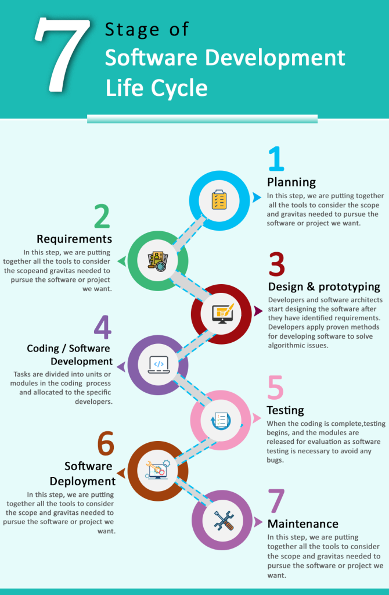

# ASSIGNMENT1
## DEFINITION OF DEVOPS
Devops is an abbreviation of developments and Operations is a software developmet ideologies and approach that aim to improve the teamwork between develoment and IT Operations, it focuses on cooperation, communication automation 

### IMPORTANCE OF DEVOPS

1. It creates better teamwork and faster time to market
Software development, testing, and deployment can be automated through continuous integration and continuous delivery (CI/CD) pipelines, leading to shorter release cycles. DevOps promotes improved communication and collaboration among development, operations, and other stakeholders, creating a more harmonious and productive workplace.

2. It brings about eficiency and good quality of work
The total productivity of development and operational workflows is increased by the automation of repetitive activities, which minimizes manual mistakes and speeds procedures, continuous testing and automated deployment help identify and address issues earlier in the development process, improving the overall quality of the software.

3. It helps with continous monitoring
Continuous monitoring of applications and infrastructure is a key principle in DevOps. This approach enables proactive problem resolution by providing real-time insights into performance.

4 It Enhances customer satisfaction, mitigates risk, adjusts to market demands and conditions, and transforms culture
Improved customer satisfaction is a result of faster software releases, better quality software, and quicker problem-solving. Features and repairs are delivered more quickly. Teams are able to react swiftly to changing business demands thanks to DevOps principles, which provide quicker adaptation to shifting requirements and market conditions. Continuous testing and automated rollback mechanisms reduce the risk of releasing defective code into production by identifying and addressing potential problems early in the development process. Additionally, DevOps frequently entails a cultural shift that fosters a more positive and productive workplace culture by encouraging collaboration, shared responsibility, and a focus on delivering value to customers.

### HISTORY OF DEVOPS

Challenges with conventional software development and IT operations procedures gave rise to the idea of DevOps. In 2001, the Agile Manifesto was created, which set the groundwork for customer-focused and cooperative software development. Infrastructure as Code, or IaC, rose to popularity in the middle of the 2000s when infrastructure settings were automated by technologies like Puppet and Chef.
Web operations teams started pursuing quicker and more dependable deployment procedures for web-based applications in the late 2000s, which gave rise to the DevOps movement. Professionals from development and operations came together for the inaugural DevOpsDays conference in 2009, which took place in Ghent, Belgium, to talk about cooperation, automation, and cultural shifts.
Three Ways are a collection of concepts that represent the essential ideals of DevOps, and they were first established in the 2013 novel "The Phoenix Project," written by Gene Kim, Kevin Behr, and George Spafford. This project served as an example of how DevOps techniques may change IT companies.
The word "DevOps" was originally used in 2009 by Patrick Debois, who also organized the inaugural DevOpsDays. In the "Declaration of DevOps," which stressed automation, cooperation, and communication, Debois articulated the guiding principles of the movement.
Practices known as Continuous Integration and Continuous Delivery (CI/CD), which emphasize automating the development, testing, and deployment of software, became popular. Jenkins, Travis CI, GitLab CI, and other tools have become essential components of the CI/CD process, the DevOps Institute was established in 2015 with the goal of offering professionals the education and certification programs necessary to get the competencies required for successful DevOps deployment.
Launched in 2014, the DevOps Enterprise Summit (DOES) gives enterprises a forum to discuss problems, best practices, and success stories related to DevOps.
Version control, continuous integration, infrastructure as code, containerization (like Docker), and orchestration (like Kubernetes) are just a few of the tools that have helped DevOps continue to grow.

### DEVOPS CULTURE
DevOps culture emphasizes collaboration, communication, automation, and shared responsibility between development and operations teams to achieve faster, more reliable software delivery.

## SDLC (Software Development LifeCycle)

### CONCEPTS OF SDLC
The Software Development Life Cycle (SDLC) is a structured process that guides the planning, creation, testing, deployment, and maintenance of software applications or systems. It begins with project planning, defining scope, objectives, and resource requirements. Requirements are gathered from stakeholders, and a detailed design is created. The implementation phase involves coding, transforming the design into executable code. Testing includes various phases like unit testing, integration testing, and user acceptance testing. Once tested, the software is deployed to production or end-users. The maintenance phase addresses issues and updates throughout the software's operational life. SDLC can take various models, such as Waterfall, Agile, Spiral, or Iterative, chosen based on project requirements and timelines.

### WHY IT IS IMPORTANT TO DEVOPS ENGINEER

Because it offers a formal framework for combining development and operations, the SDLC is essential for DevOps engineers. This allows for continuous integration, delivery, and deployment. It guarantees a methodical approach to software development, promoting efficiency, automation, and teamwork across the course of the project.

### WHERE DEVOPS FITS IN SDLC
DevOps is a methodology that connects development (Dev) and operations (Ops) across the Software Development Life Cycle (SDLC). It covers the complete software development life cycle, from planning and coding to testing, deployment, and monitoring. DevOps approaches emphasize cooperation, automation, and continuous improvement throughout various phases, resulting in a simplified and effective software delivery process.

### CAN DEVOPS IMPROVE THE SDLC PROCESS
Yes it can. DevOps enhances the Software Development Life Cycle (SDLC) by focusing on collaboration, automation, and continuous improvement. DevOps speeds up development and deployment by using processes like as continuous integration, deployment, and monitoring. It also improves software quality and efficiency. It encourages quicker adaptability to changing needs, adheres to Agile principles, and creates feedback loops for rapid issue discovery and resolution. Furthermore, DevOps helps to mitigate risk by allowing early identification of possible issues and encouraging a cultural shift toward shared accountability and customer-centric value delivery. To summarize, DevOps improves the SDLC by making it more streamlined, adaptable, and efficient.

### IMAGES OF SDLC
`SDLC IMAGE` to show the processes involved in SDLC 

# Assignment 2

## Introduction to Operating Systems

### What is an Operating System?
An Operating System (OS) is a crucial software component that acts as an intermediary between computer hardware and user applications. It provides a platform for users to interact with the computer and efficiently manages hardware resources. The OS ensures that various software applications can run smoothly and that the hardware resources are utilized optimally.

### Tasks of an Operating System
1. Process Management:
Process Scheduling: Allocates CPU time to various processes.
Process Creation and Termination: Initiates and terminates processes.
2. Memory Management:
Memory Allocation: Assigns and deallocates memory space for processes.
Virtual Memory: Manages the use of secondary storage as an extension of RAM.
3. File System Management:
File Creation, Deletion, and Manipulation: Handles file-related operations.
Directory Management: Organizes and maintains directories.
4. Device Management:
I/O Operations: Controls communication between devices and the computer.
Device Drivers: Provides a software interface to hardware devices.
5. Security and Protection:
User Authentication: Controls access to the system.
Data Protection: Ensures data integrity and confidentiality.
6. User Interface:
Command-Line Interface (CLI) and Graphical User Interface (GUI): Provides user interaction methods.
Components of an Operating System
- Kernel:
The core component that manages system resources and provides essential services.
- Shell:
The user interface that interprets user commands and communicates with the kernel.
- File System:
Manages data storage, retrieval, and organization on storage devices.
- Device Drivers:
Software components that enable communication between the OS and hardware devices.
- System Libraries:
Collections of pre-compiled code used by applications for common tasks.

### Types of Operating Systems
1. Single-User, Single-Tasking OS:
Supports one user and one task at a time.
2. Single-User, Multi-Tasking OS:
Allows a single user to perform multiple tasks concurrently.
3. Multi-User OS:
Supports multiple users accessing the system simultaneously.
4. Real-Time OS:
Prioritizes task execution based on time constraints.
5. Network OS:
Facilitates communication and resource sharing across a network.

### Linux Operating System
#### Overview:
A popular open-source Unix-like OS kernel.

#### Key Features:
- Multi-user and multi-tasking capabilities.
- Robust security features.
- Large software repository.

#### Components:
- Linux Kernel: The core component managing hardware resources.
- Shell: Commonly Bash, providing the user interface.
GNU Utilities: Essential command-line tools.
Package Management: Systems like APT or YUM for software installation.

## Introduction to Virtualization and Virtual Machines

### Server
A server is a specialized computer or software that provides services or resources to other computers, known as clients, within a network. Servers can offer various functionalities, such as hosting websites, managing files, processing requests, and more. They are designed to be robust, reliable, and capable of handling multiple requests simultaneously.

#### Types of Servers:
- Web Server: Hosts websites and serves web pages to users.
- File Server: Manages and provides access to files within a network.
- Database Server: Stores and retrieves data for database applications.
- Application Server: Runs and manages applications for client computers.
- Mail Server: Handles email communication and storage.

### Virtualization
Virtualization is a technology that enables the creation of virtual versions of computing resources, such as servers, storage, or networks. It allows multiple operating systems or applications to run on a single physical machine, optimizing resource utilization and enhancing scalability and flexibility.

### What is a Virtual Machine?
A Virtual Machine (VM) is a software emulation of a physical computer. It operates like an independent computer within a host system and runs its own operating system. VMs are created by virtualization software, which enables the execution of multiple VMs on a single physical machine.

### What is a Hypervisor?
A hypervisor, also known as a Virtual Machine Monitor (VMM), is a crucial component in virtualization technology. It sits between the hardware and the operating systems or VMs, managing the allocation of resources and ensuring isolation between different virtual environments. There are two types of hypervisors: Type 1 (bare-metal) runs directly on the hardware, while Type 2 (hosted) runs on top of an existing operating system.

### Physical Machine vs Virtual Machine
#### Physical Machine:
- Hardware Dependency: Runs directly on physical hardware.
- Resource Utilization: Limited to the capabilities of the physical hardware.
- Isolation: Each physical machine operates independently.
- Scalability: Requires additional physical hardware for scalability.
#### Virtual Machine:
- Hardware Independence: Operates on virtualized hardware provided by the hypervisor.
- Resource Utilization: Optimizes resource sharing and allocation.
- Isolation: VMs are isolated from each other, enhancing security.
Scalability: Multiple VMs can run on a single physical machine, improving scalability.